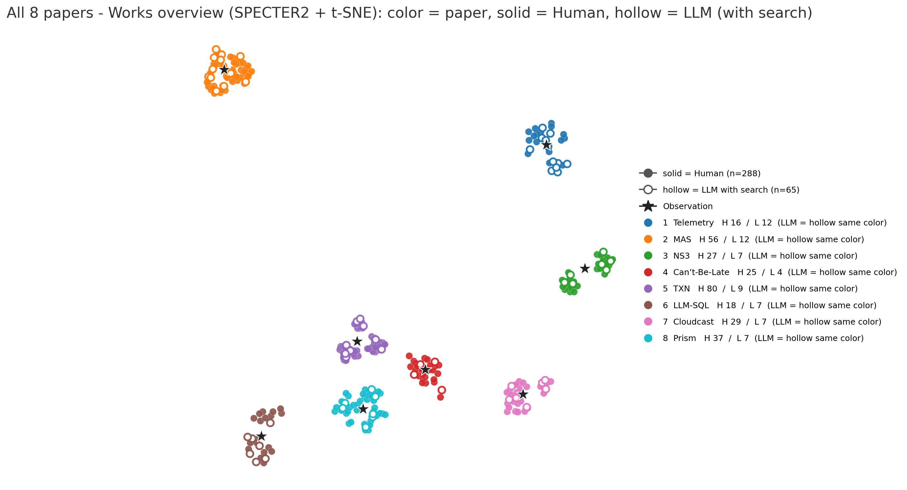
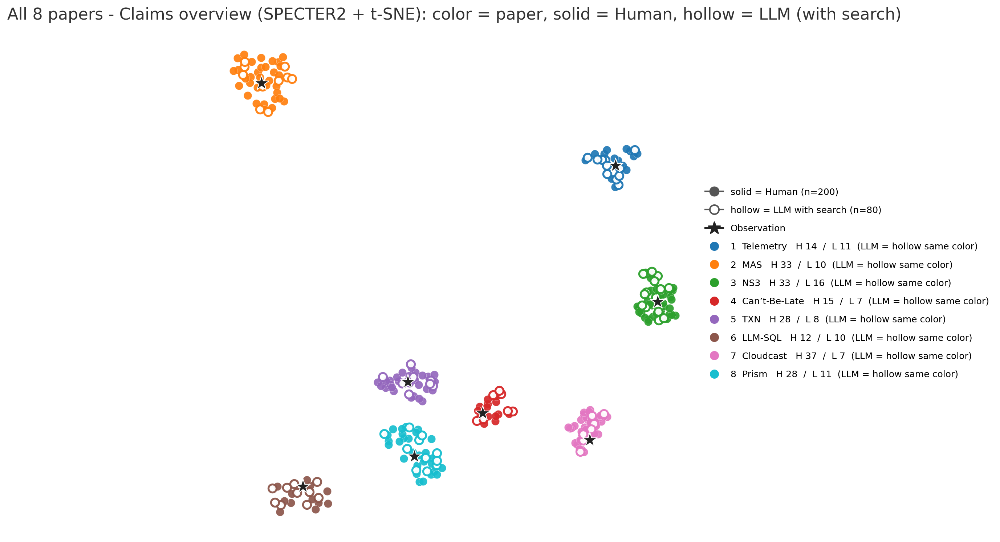
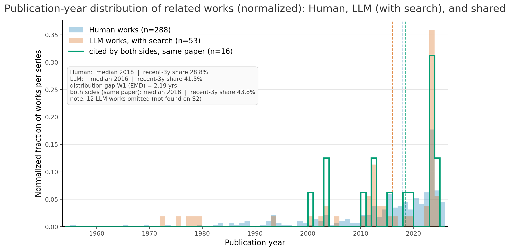

# LLM 生成相关工作的语义分布 与 Solution 执行效果

---

## 一、核心结论

1. **LLM 生成的相关工作与人类的相关工作在语义空间里是"同一片区域的稀疏采样"，不是两片区域。** 集合质心余弦 0.982、对 Observation 的贴合度 0.865(H) vs 0.869(L) 几乎相同；但体量只有人类的 0.23×（篇均 7–8 篇 vs 36 篇），严格同题重合仅 5.6%。
2. **偏置是系统性的**：LLM 选文的中位被引数是人类的 **6.3 倍**（902 vs 144），近 3 年文献占比 41.5% vs 28.8%，篇内引用年份跨度 9.5 年 vs 31.0 年。它取的是**高被引经典 + 近期热点**，跳过中间层与长尾。
3. **这个分布特征直接解释了后面的 Solution 表现**：LLM 的 idea 是在正确的方法空间里、用**成熟机制模板**拼出来的（这正是它赢的两个案例的取胜方式），但它不携带"这个系统的定量事实"——0/80 条 claim 含任何数字，覆盖率仅覆盖人类原子断言的 24.1%。
4. **实测 5 个可运行任务：真赢 1 个、指标赢 1 个、真输 3 个**。cloudcast 是结构性的真赢（改写目标函数，成本 −23%）；llm_sql 的分差 100% 来自运行时间项，命中率反而低 1.7pp；prism/txn/cant-be-late 真实劣于 seed，其中两个的大分差来自同一个机制——代理目标/参数假设与真实系统不一致。
5. **失败的共同根因不是"不懂问题"，而是"代理目标失配"**：三个负例全部是把自洽的机制叙事建立在一个与真实代价函数不对应的代理量上。LLM 的 idea 在**语义层正确、数值/因果层不闭环**。

---

## 二、LLM 生成相关工作的语义分布 vs 人类分布

### 2.1 图与口径

编码：SPECTER2(specter2_base) 768 维 → t-SNE（另附 SciBERT 批次，结论一致）。总图用"岛屿布局"：每篇论文一个独立区域，颜色 = 论文，实心 = Human，空心 = LLM(with search)，★ = Observation。

**结论：每座"岛"内部，橙点（LLM）与蓝点（Human）交错分布在同一片区域，且都围着 ★（Observation）——即分布同向、共位，不存在"LLM 漂到别的主题上"的现象。** 逐论文图（`works_2d_<论文>.png` ×8）放大后同样如此：LLM 的点落在人类点云的密度中心附近，人类在长尾方向上的点没有对应物。

### 2.2 三层相关关系

| 层次 | 指标 | Human | LLM(with search) | 相关关系 |
|---|---|---:|---:|---|
| **方向（空间位置）** | 两集合质心余弦 | — | **0.982** | 高度同向 |
| | Observation 贴合度 Rel | 0.865 | 0.869 | 几乎相同 |
| | 集合内部聚合度（类内余弦） | 0.856 | 0.870 | 相当（LLM 略更紧凑） |
| **密度（覆盖）** | 篇均 works | 36.0（288/8） | 8.1（65/8） | **0.23×** |
| | 严格同题重合 | 16 个工作实例：人类侧召回 5.6%、LLM 侧精确 24.6% | | 稀疏采样 |
| | 三级匹配（含标题近似/语义） | 召回 15.7% / 精确 60.8% / Jaccard 0.140 | | 遗漏 ≠ 离题 |
| **时间** | 中位发表年份 | 2018 | 2016 | 分布差 W1 = **2.19 年** |
| | 近 3 年占比 | 28.8% | **41.5%** | LLM 偏新 |
| | 篇内引用年份跨度 | 31.0 年 | **9.5 年** | LLM 只取一个窄时段 |
| **影响力度** | 中位被引数 | 144 | **902（6.3×）** | 强烈偏爱经典 |
| | ≥1000 次引用占比 | 16% | 44% | |
| | <50 次引用占比 | 26% | 2% | 几乎不引冷门工作 |

时间分布图：

### 2.3 数据侧印证（`merged_llm_re_withsearch` vs `human_data`，8 篇逐条核对）

| 维度 | Human | LLM | 比值 / 说明 |
|---|---:|---:|---|
| claims（句子） | 200 | 80 | 0.40× |
| works（文档内去重） | 288 | 65 | **0.23×** |
| 相关工作段落 | 68 | 32 | 0.47× |
| 逐字相同的 claim | — | **0/80** | 无照抄；2-gram Jaccard 仅 0.035 |
| claim 平均词数 | 20.8 | 27.9 | 1.34×（句子更长、更均匀） |
| 等 token 预算下的词汇丰富度 | — | — | **±2%，无差异**（不是"词穷"） |
| 每条被引 work 对应的 claim 文本量 | 0.69 claims/work | 1.23 claims/work | 1.8×（说得更多、引得少） |
| 含数字的 claim | 8.0% | **0%** | 只给方向性论断，不给可核查事实 |
| claim 中命名所引系统的比例 | 81.5% | 73.8% | 表述更抽象 |
| 期刊/会议集合 Jaccard | — | — | 0.145（人类 99 个 vs LLM 27 个） |
| 无法在 Semantic Scholar 解析 | 8.0% | 18.8% | 抽查 12 篇全部真实存在，属检索/API 失败，**非编造** |

**关键性质：LLM 写的是一篇"不同的相关工作"，而不是人类那篇的改写。** 重合的 16 个工作实例、0/80 逐字或近义 claim、0.145 的 venue Jaccard 共同说明这一点；但"不同"发生在**同一语义流形上**，方向一致、密度和选材偏好不同。

### 2.4 对 LLM 用于 idea / algorithm 生成的结论

| 观测 | 对 idea/算法生成的含义 |
|---|---|
| 质心余弦 0.982、Rel 与人类持平 | **定位可靠**：LLM 能准确识别问题所在的"方法社区"。idea 不会跑偏到无关领域。 |
| 偏爱高被引经典（6.3×）+ 近期热点，跳过中间层与长尾 | **机制来源是"成熟模板"而非"长尾组合"**。好处：提出的机制有大量先例支撑，可行性有下限；代价：新颖性来自跨域搬运，而非领域深挖。 |
| 引用年份跨度 9.5 年（人类 31 年） | **缺历史纵深**：没有建立富有逻辑关系的领域发展脉络，不能深刻理解领域背景 |
| 0/80 含数字、仅覆盖人类原子断言 24.1% | **只有方向、没有可核查事实**。idea 层面的论断无法自证，必须靠下游实测淘汰。 |
| 开检索无增益（幻觉/不可解析率 18.5% vs 禁检索 13.3%），且相关工作质量缺陷**不传导**到方案质量（6 项 Spearman 全部不显著） | **LLM 的 idea 生成不依赖穷举文献**，靠的是参数化知识中的方法模板库；相关工作更像是"论证材料"而不是"推理依据"。 |

> 总结：**相关工作分布的同向性保证了 idea 的"方向正确"，分布的稀疏性与经典/热点偏置决定了 idea 的"来源单一"——它是优秀的方法搬运工，不是文献综述驱动的发现者。**

---

## 三、LLM 生成 Solution 的执行结果

8 篇论文 → ADRS 官方 evaluator 实跑，未修改任何测试代码。**5 个可测：真赢 1、指标赢 1、真输 3**（其余 3 篇：Telemetry、NS3 在 ADRS 无对应任务目录；MAS 测试环境不完整——`evaluator.py` import 即缺 `taxonomy_definitions_examples/`，且依赖外部 API key）。

### 3.1 结果表

| 论文 | 任务 | 指标（越大越好） | LLM solution | seed 基线 | SOTA | 相对变化(相对seed) | 判定 |
|---|---|---|---:|---:|---:|---|---|
| Cloudcast  | `cloudcast` | `combined_score` = 1/(1+cost) | **0.00124095** | 0.00095524 | 0.00159429 | 成本 \$1045.86 → **\$804.83（−23%）** | ✅ 胜 |
| LLM-SQL | `llm_sql` | `combined_score` | **0.68783** | 0.67174 | 0.729 | **+2.4%**；运行 351.6 s → 21.4 s（**16×**）；命中率 0.707 → 0.690 | ✅ 胜 |
| Prism | `prism` | `combined_score` = 1/mean(kvpr) + success_rate | 20.627 | 21.892 | 26.26 | mean kvpr 0.04787 → 0.05095，综合分 −5.8% | ❌ 负 |
| TXN | `txn_scheduling` | `combined_score` = 1e6/(1+makespan) | 1718.21 | 2793.30 | 4238.6| makespan **357 → 581（+63%）** | ❌ 负 |
| Can't-Be-Late  | `cant-be-late` | `combined_score` = −(avg_cost+0.25·std) | −153.53 | −106.75 | -95.69 | 平均成本 \$96.52 → **\$140.82（+46%）** | ❌ 负 |

汇总：**真赢 1 个（cloudcast）、"指标赢" 1 个（llm_sql，全靠运行时间项）、真输 3 个。** 胜例都不是靠调参，而是靠引入了新的结构（共享边、排序目标）。

### 3.1.1 数值为什么是这样（逐任务分解）

五个任务的 `combined_score` 都是原始量的**非线性映射**，分数差 ≠ 差距本身：

| 任务 | 公式形态 | 原始量变化 | 分数变化 | 放大/压缩 |
|---|---|---|---|---|
| cloudcast | 1/(1+cost)，双曲 | 总成本 1045.86 → 804.83（**−23.0%**） | +29.9% | 放大 |
| llm_sql | 0.95·hit + 0.05·(12−min(12,rt))/12 | hit 0.70710 → 0.69008（**−1.7pp**）；rt 70.3 s → 4.27 s | +2.4% | 见下 |
| prism | 1/mean(kvpr) + 1，双曲 | mean kvpr 0.04787 → 0.05095（**+6.4%**） | −5.8% | 放大（1/x² ≈ 400） |
| txn | 1e6/(1+makespan)，双曲 | makespan 357 → 581（**+62.8%**） | −38.5% | 压缩 |
| cant-be-late | −(avg_cost + 0.25·std) | 成本 96.52 → 140.82（**+45.9%**）、std 40.92 → 50.87 | −43.9% | 近乎线性 |

**① Cloudcast：结构性的真赢。** 模拟器按"每条边被多少个 partition 经过 × 流量 × 单价"计费；seed 的逐目标最短路让同一条边为每个目标重复付一次钱，LLM 的多播树让 occurrence 被下游共享，成本直接按共享度下降。**赢在改写了目标函数，且成本是模拟器直接返回的真值——没有代理环节。**

**② LLM-SQL：这个"胜"100% 来自运行时间项，命中率其实更低。**

| 分项 | seed | LLM | 差 |
|---|---|---|---|
| avg_hit_rate | 0.70710 | 0.69008 | **−0.01702**（×0.95 → **−0.0162**） |
| avg_runtime | 70.32 s（351.578/5） | 4.275 s（21.374/5） | 快 16.4× |
| 运行时间项 | **0**（70.32 > 12 s 上限，被截断） | **+0.03219** | **+0.0322** |
| `combined_score` | 0.67174 | 0.68783 | +0.0161 |

运行时间项是**悬崖而不是梯度**：rt > 12 s 恒为 0，seed 的 70 s 超限 6 倍必然拿 0，LLM 只要跑进 12 s 就拿满 0.05。**LLM 的赢法不是"做得更好"，而是"做的工作更少"**（单遍贪心排序 vs seed 在 `early_stop=100000` 空间里的搜索）。逐数据集命中率：movies 79.40/79.41（持平）、beer 69.65/70.73（差）、BIRD 79.59/79.49（微好）、PDMX **32.22/39.68（明显退步）**、last 84.21/84.24（持平）——1 个明显退步、3 个持平、1 个微好。

**③ Prism：差在一个排序键里的除法。** mean kvpr 差 0.00308，经 1/x 映射放大成 1.264 分。根因是排序键 `(req_rate/slo)/model_size` 多除了 `model_size`，优先抬小模型，而目标是 min-max 装箱。消融已把该因子单独隔离：换回 seed 的排序键、放置规则不变 → **22.34（反超 seed 21.89）**；用 LLM 的键 → 20.63。**−1.26 分完全归因于这一个除法。**

**④ TXN：makespan 是 3 个 workload 的加和，LLM 只在其中两个上输**（stdout `452 38 91` → 581；`252 57 48` → 357）。

| workload | seed | LLM | 变化 |
|---|---:|---:|---|
| W1 | 252 | **452** | +79% |
| W2 | 57 | **38** | **−33%（更好）** |
| W3 | 48 | **91** | +90% |
| 合计 | 357 | 581 | +63% |

**W1 一个 workload 就占 LLM 总分的 78%（452/581），而 W1 正是冲突图退化为近乎完全图的情形**——着色代理（各类最大时长之和）给 1600、真实锁冲突仿真只有 452，代理与真值不仅差 3.5 倍，排序也不一致。seed 直接在真值代价上贪心，本来就在"真值赛道"上。另需注意这份 581 **不代表 LLM idea 的完整实力**：solution 规定的 beam search 在 W1 上被剪空（每层只剩 1 个后继、26 层后死亡），实际执行的是 DSATUR + 局部搜索，**方案里最重的那部分根本没跑**。

**⑤ Can't-Be-Late：一个参数假设不成立触发的抖动。** 两个分量都恶化——均值 +45.9%，标准差 +24.3%，后者经 0.25 权重额外贡献 −2.5 分（若只有均值恶化，分数会是 −140.82，实际 −153.53）。机理：δ = `restart_overhead` = 72 s（固定），τ = 控制周期 = 600 s；solution 的撤销阈值 `2Rδ` 与启用阈值 `Rδ+Rτ` 在 **τ > δ 时交叉**（600 是 72 的 8.3 倍），不稳定区间导致控制器每 1–2 tick 切换，trace 0 有 **219/313 tick 跑 ON_DEMAND**。去掉 `Rτ` 项（即按 solution 自己写的"τ 小到 Rτ ≪ Rδ"来办）后：成本 140.82 → 106.54，分数 −153.53 → −116.99。

### 3.1.2 一个必须说清的结构性不公平

- **seed 是在该任务真值代价函数上直接搜索的程序**（txn 的 seed 直接调用真值代价、cbl 的 seed 是任务自带贪心、llm_sql 的 seed 是原始实现），而 **LLM solution 是一次生成、零反馈**的（输入只有 Observation + 相关工作，没有 evaluator 反馈、没有迭代）。
- ADRS 论文的成绩来自"生成—评估—修正"的循环（几十上百次迭代）；本实验是**单次零样本**。
- 因此准确的表述是：**"LLM 的零样本 idea 对比已手工调好的 seed，1 真胜 1 指标胜 3 负"**，而非"LLM 做不出好方案"。

### 3.2 逐案例结论（LLM分析）

| 案例 | 机制 | 为什么 |
|---|---|---|
| Cloudcast ✅ | 把批量复制重述为**带截止期的最小成本多播**（割约束 LP + Steiner 树 + 速率罚项），让一条边的 occurrence 被所有下游目标共享 | 切中模拟器的真实计费方式（同一条边被多个 partition 经过会**重复计费**），逐目标最短路天然吃亏 |
| LLM-SQL ✅ | **前缀感知的物理规划器**：按 one-level reuse gain 贪心排字段序、行序 = 前缀组深度优先遍历 | 切中命中率的真实来源（KV 前缀复用），且顺带把运行时间压到 1/16 触发运行时奖励 |
| Prism ❌ | 排序键取 (req_rate/slo)/**model_size**，按"放入后 KVPR 最小"贪心放置 | 除以 model_size 优先抬小模型，对 **min-max 装箱**不利。消融：换成 seed 的排序键用同一放置规则可得 22.34 > seed 21.89 |
| TXN ❌ | 带权 DSATUR + beam search + 局部搜索的**图着色 anytime 规划器** | 代理代价（各类最大时长之和）与真实代价（**锁冲突顺序仿真**，冲突交易可部分重叠）几乎不相关：W1 代理 1600 / 真实 452 |
| Can't-Be-Late ❌ | "受保护进度/回退线"控制不变量，双阈值切换 ON_DEMAND/SPOT 锚点 | 两条阈值在 **τ > δ 时交叉**，状态区间不稳定 → 每 1–2 tick 抖动，trace 0 有 **219/313 tick 跑按需实例**（seed 只在临近 deadline 才用） |

### 3.3 方法层面：LLM 生成 idea 的优势与瓶颈

**优势（两个胜例的共同点）**

1. **问题重述 + 跨域类比能力**：能把系统问题映射到成熟的算法范式（多播+割约束 LP、前缀共享规划、加权图着色、控制不变量），且映射在数学上自洽。
2. **抓住真实收益来源**：Cloudcast 识别出"边被重复计费"、LLM-SQL 识别出"字段序/行序决定 KV 前缀复用"——两者都是该任务性能的主项。
3. **引入结构而非调参**：胜例都改变了问题的表示（共享边、排序目标），不是微调超参。

**瓶颈（按严重性排序，三个负例共同指向）**

1. **代理目标失配（最致命）**。LLM 优化的是它**自己叙述出来的**代价函数，不是 evaluator 的真实代价。TXN 的着色 makespan 与锁冲突仿真几乎不相关；Prism 的排序键方向搞反。**它在文本层面把问题讲对了，在数值层面把目标建错了。**
2. **参数 / 时序假设不成立，且不可自检**。Can't-Be-Late 的阈值交叉使控制器高频抖动，成本 +46%。solution 自己写了"τ 需小到 Rτ ≪ Rδ"，但任务的控制粒度固定 600 s，是 δ=72 s 的 8 倍——**假设被写出来了，却没有被验证**。去掉 Rτ 项后成本从 +46% 收敛到 +10%（−153.53 → −116.99），证明失配源于假设而非逻辑。
3. **算法内部不稳健**。TXN 的 beam search 被"代价下界 + 最便宜优先"剪空（实测每层只剩 1 个后继、26 层后死亡），实际退化为 DSATUR+局部搜索；实现过程中还出现过 `validity=0`（不完整的部分着色被接受）——**生成出的算法自身缺少终止性/完备性保障。**
4. **规格留白由实现补齐**。Prism 未规定"模型放到哪块 GPU"，靠实现按"压力最小"补齐。这类未定义处是隐藏的分数方差来源：同一份 idea 由不同实现落地，结果可能跨过 seed 基线。

**统一根源**：LLM 的 idea 在**语义层正确、在数值/因果层不闭环**。它能提出自洽的机制叙事（因此读者/LLM 裁判给出高分：Rubric 4.41 > 人类基线 4.19），但对**真实代价函数的形状、参数尺度、约束边界**没有可验证的把握。这与第二部分完全一致：它的知识来源是"高被引经典 + 近期热点"构成的**机制模板库**，模板给出的是结构，不是这个系统的定量事实。

