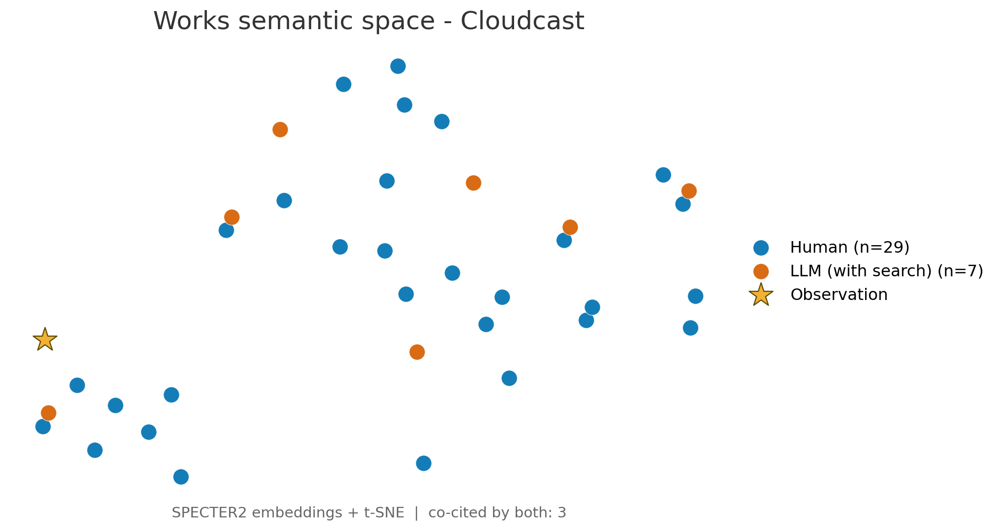
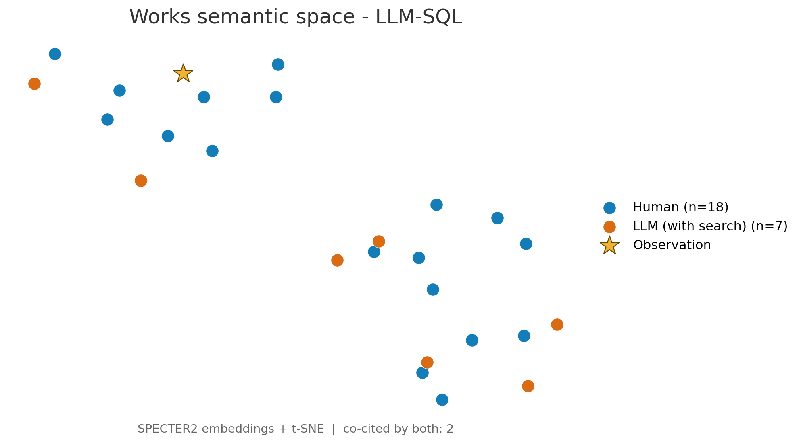
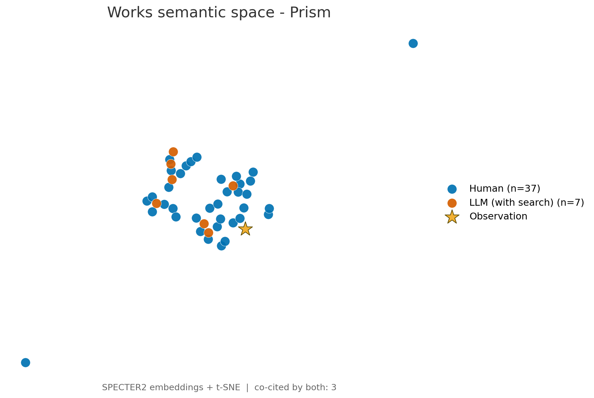
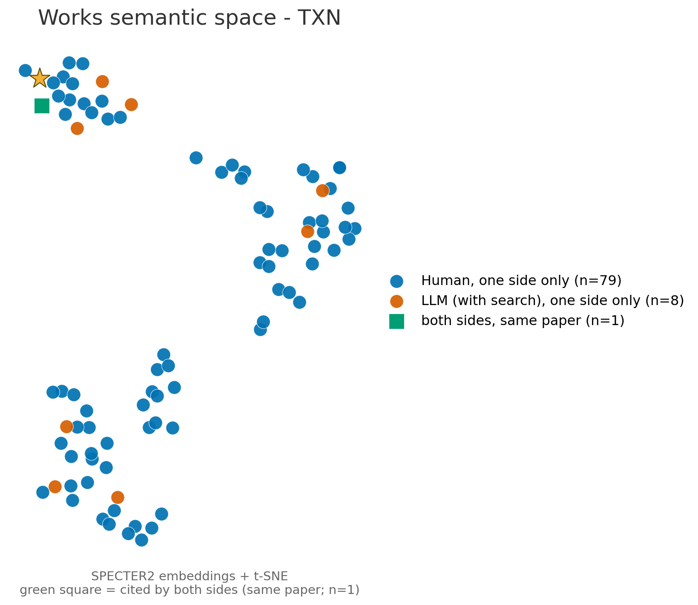
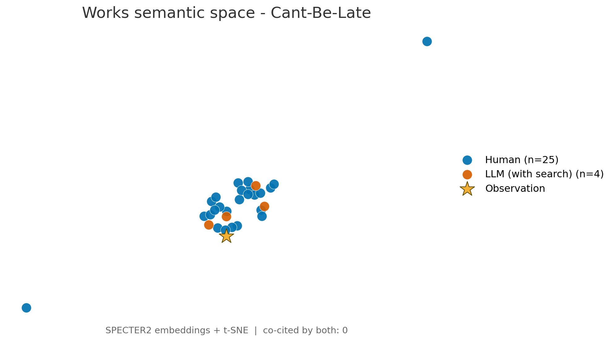
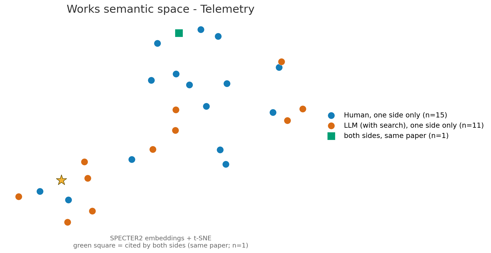
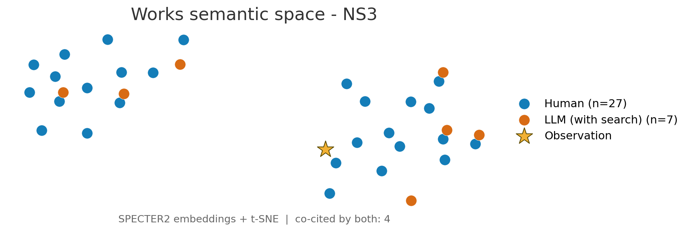
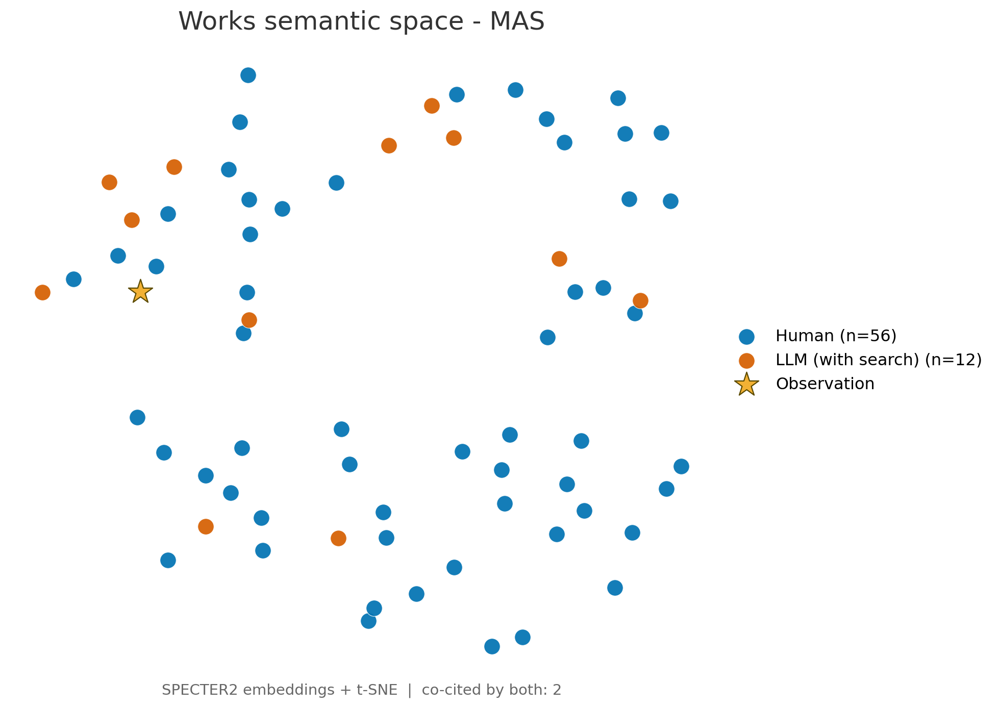

# LLM 生成相关工作的语义分布 与 Solution 执行效果

---

## 一、核心结论

1. **LLM 生成的相关工作与人类的相关工作在语义空间里是"同一片区域的稀疏采样"，不是两片区域。** 集合质心余弦 0.982、对 Observation 的贴合度 0.865(H) vs 0.869(L) 几乎相同；但体量只有人类的 0.23×（篇均 7–8 篇 vs 36 篇），严格同题重合仅 5.6%。
2. **偏置是系统性的**：LLM 选文的中位被引数是人类的 **6.3 倍**（902 vs 144），近 3 年文献占比 41.5% vs 28.8%，篇内引用年份跨度 9.5 年 vs 31.0 年。它取的是**高被引经典 + 近期热点**，跳过中间层与长尾。
3. **这个分布特征直接解释了后面的 Solution 表现**：LLM 的 idea 是在正确的方法空间里、用**成熟机制模板**拼出来的（这正是它赢的两个案例的取胜方式），但它不携带"这个系统的定量事实"——0/80 条 claim 含任何数字，覆盖率仅覆盖人类原子断言的 24.1%。
4. **实测 5 个可运行任务：真赢 1 个、指标赢 1 个、真输 3 个**。cloudcast 是结构性的真赢（改写目标函数，成本 −23%）；llm_sql 的分差 100% 来自运行时间项，命中率反而低 1.7pp；prism/txn/cant-be-late 真实劣于 seed，其中两个的大分差来自同一个机制——代理目标/参数假设与真实系统不一致。**人类 solution 的同口径对照（§3.4）：人类侧真赢 1（cloudcast，成本 −39%，比 LLM 更省）、持平 1（llm_sql）、打平 1（cant-be-late）、真输 2（prism −10%、txn −16%）；人类 vs LLM 3 胜 2 负。** **第三个对照（§3.5，把 LLM 的输入换成人类写的相关工作）：真赢 1（cloudcast，成本 −37.9%，三侧里唯一贴近人类的）、打平 1（txn）、真输 3；对 LLM 自生成 RE 3 胜 2 负，对论文人类 solution 2 胜 3 负。** 三侧合起来说明：胜负取决于**代理目标与真实代价函数的对齐程度**，而不是方案出自人还是模型——三侧唯一共同的大胜用的是同一个机制（共享边的多播树，直接命中评测器的计费方式），而三侧在 prism 上共同失败、其中两侧是从**相反方向**偏离同一个 min-max 目标。
5. **失败的共同根因不是"不懂问题"，而是"代理目标失配"**：三个负例全部是把自洽的机制叙事建立在一个与真实代价函数不对应的代理量上。LLM 的 idea 在**语义层正确、数值/因果层不闭环**。

---

## 二、LLM 生成相关工作的语义分布 vs 人类分布

### 2.1 图与口径（8 篇逐篇）

编码：SPECTER2(specter2_base) 768 维 → t-SNE（另附 SciBERT 批次）。

#### ① 实测胜出 / 持平的两篇

#### ② 实测落败的三篇

#### ③ ADRS 无对应任务、未实测的三篇

#### 逐篇计数汇总

| 论文 | 实测判定 | 人类 works | LLM works | LLM/Human | 两侧同篇 |
|---|---|---:|---:|---:|---:|
| Cloudcast | ✅ 胜 | 29 | 7 | 0.24× | 3 |
| LLM-SQL | ✅ 胜（指标） | 18 | 7 | 0.39× | 2 |
| Prism | ❌ 负 | 37 | 7 | 0.19× | 3 |
| TXN | ❌ 负 | 80 | 9 | 0.11× | 1 |
| Can't-Be-Late | ❌ 负 | 25 | 4 | 0.16× | 0 |
| Telemetry | — 无任务 | 16 | 12 | 0.75× | 1 |
| NS3 | — 无任务 | 27 | 7 | 0.26× | 4 |
| MAS | — 环境不完整 | 56 | 12 | 0.21× | 2 |
| **合计** | | **288** | **65** | **0.23×** | **16** |

### 2.2 三层相关关系

| 层次 | 指标 | Human | LLM(with search) | 相关关系 |
|---|---|---:|---:|---|
| **方向（空间位置）** | 两集合质心余弦 | — | **0.982** | 高度同向 |
| | Observation 贴合度 Rel | 0.865 | 0.869 | 几乎相同 |
| | 集合内部聚合度（类内余弦） | 0.856 | 0.870 | 相当（LLM 略更紧凑） |
| **密度（覆盖）** | 篇均 works | 36.0（288/8） | 8.1（65/8） | **0.23×** |
| | 严格同题重合 | 16 个工作实例：人类侧召回 5.6%、LLM 侧精确 24.6% | | 稀疏采样 |
| | 三级匹配（含标题近似/语义） | 召回 15.7% / 精确 60.8% / Jaccard 0.140 | | 遗漏 ≠ 离题 |
| **时间** | 中位发表年份 | 2018 | 2016 | 分布差 W1 = **2.19 年** |
| | 近 3 年占比 | 28.8% | **41.5%** | LLM 偏新 |
| | 篇内引用年份跨度 | 31.0 年 | **9.5 年** | LLM 只取一个窄时段 |
| **影响力度** | 中位被引数 | 144 | **902（6.3×）** | 强烈偏爱经典 |
| | ≥1000 次引用占比 | 16% | 44% | |
| | <50 次引用占比 | 26% | 2% | 几乎不引冷门工作 |

### 2.3 数据侧印证（`merged_llm_re_withsearch` vs `human_data`，8 篇逐条核对）

| 维度 | Human | LLM | 比值 / 说明 |
|---|---:|---:|---|
| claims（句子） | 200 | 80 | 0.40× |
| works（文档内去重） | 288 | 65 | **0.23×** |
| 相关工作段落 | 68 | 32 | 0.47× |
| 逐字相同的 claim | — | **0/80** | 无照抄；2-gram Jaccard 仅 0.035 |
| claim 平均词数 | 20.8 | 27.9 | 1.34×（句子更长、更均匀） |
| 等 token 预算下的词汇丰富度 | — | — | **±2%，无差异**（不是"词穷"） |
| 每条被引 work 对应的 claim 文本量 | 0.69 claims/work | 1.23 claims/work | 1.8×（说得更多、引得少） |
| 含数字的 claim | 8.0% | **0%** | 只给方向性论断，不给可核查事实 |
| claim 中命名所引系统的比例 | 81.5% | 73.8% | 表述更抽象 |
| 期刊/会议集合 Jaccard | — | — | 0.145（人类 99 个 vs LLM 27 个） |
| 无法在 Semantic Scholar 解析 | 8.0% | 18.8% | 抽查 12 篇全部真实存在，属检索/API 失败，**非编造** |

**关键性质：LLM 写的是一篇"不同的相关工作"，而不是人类那篇的改写。** 重合的 16 个工作实例、0/80 逐字或近义 claim、0.145 的 venue Jaccard 共同说明这一点；但"不同"发生在**同一语义流形上**，方向一致、密度和选材偏好不同。

### 2.4 对 LLM 用于 idea / algorithm 生成的结论

| 观测 | 对 idea/算法生成的含义 |
|---|---|
| 质心余弦 0.982、Rel 与人类持平 | **定位可靠**：LLM 能准确识别问题所在的"方法社区"。idea 不会跑偏到无关领域。 |
| 偏爱高被引经典（6.3×）+ 近期热点，跳过中间层与长尾 | **机制来源是"成熟模板"而非"长尾组合"**。好处：提出的机制有大量先例支撑，可行性有下限；代价：新颖性来自跨域搬运，而非领域深挖。 |
| 引用年份跨度 9.5 年（人类 31 年） | **缺历史纵深**：没有建立富有逻辑关系的领域发展脉络，不能深刻理解领域背景 |
| 0/80 含数字、仅覆盖人类原子断言 24.1% | **只有方向、没有可核查事实**。idea 层面的论断无法自证，必须靠下游实测淘汰。 |
| 开检索无增益（幻觉/不可解析率 18.5% vs 禁检索 13.3%），且相关工作质量缺陷**不传导**到方案质量（6 项 Spearman 全部不显著） | **LLM 的 idea 生成不依赖穷举文献**，靠的是参数化知识中的方法模板库；相关工作更像是"论证材料"而不是"推理依据"。 |

> 总结：**相关工作分布的同向性保证了 idea 的"方向正确"，分布的稀疏性与经典/热点偏置决定了 idea 的"来源单一"——它是优秀的方法搬运工，不是文献综述驱动的发现者。**

---

## 三、LLM 生成 Solution 的执行结果

8 篇论文 → ADRS 官方 evaluator 实跑，未修改任何测试代码。**5 个可测：真赢 1、指标赢 1、真输 3**（其余 3 篇：Telemetry、NS3 在 ADRS 无对应任务目录；MAS 测试环境不完整——`evaluator.py` import 即缺 `taxonomy_definitions_examples/`，且依赖外部 API key）。

本节是**三侧同口径**：主表（§3.1）的第 4 列是 LLM 自生成相关工作条件下的 solution，第 5 列是同一批 LLM
换成**人类相关工作**输入后的 solution（§3.5），第 6 列是从论文抽出的**人类 solution**（§3.4）。三侧的
程序与结果目录分别是 `sky-discovertest/{generation_program, generation_program_with_human_relatedworks,
genration_program_human}` 与 `sky-discovertest/{output, output_with_human_relatedworks, output_human}`。

### 3.1 结果表

"人类 solution" 列 = 把 `data/human_data/` 里从论文抽出的 solution（idea + implementation）实现成同一接口、
在同一 evaluator 上跑出的分数（详见 §3.4；产物在 `sky-discovertest/genration_program_human/` 与
`sky-discovertest/output_human/`）。
"LLM（人类 RE）" 列 = LLM 的 solution 但**输入换成人类写的相关工作**（`data/LLM_data/merged_human_re/`），
即 §3.5 的第二对照。

| 论文 | 任务 | 指标（越大越好） | LLM solution（自生成 RE） | LLM solution（人类 RE） | 人类 solution | seed 基线 | SOTA | 判定(LLM自RE / LLM人类RE / 人类) |
|---|---|---|---:|---:|---:|---:|---:|---|
| Cloudcast  | `cloudcast` | `combined_score` = 1/(1+cost) | 0.00124095（成本 \$1045.86 → \$804.83，−23%） | **0.00153675**（成本 \$1045.86 → **\$649.72**，−37.9%） | **0.00156953**（成本 → \$636.13，−39%） | 0.00095524 | 0.00159429 | ✅ 胜 / ✅ **胜** / ✅ **胜** |
| LLM-SQL | `llm_sql` | `combined_score` | **0.68783**（+2.4%；运行 351.6 s → 21.4 s（**16×**）；命中率 0.707 → 0.690） | 0.66525（−1.0%；运行 351.6 s → 52.0 s；命中率 0.707 → 0.693） | 0.67263（+0.13%；运行 → 383.3 s；命中率 → **0.708**） | 0.67174 | 0.729 | ✅ 胜 / ❌ 负 / ≈ 持平 |
| Prism | `prism` | `combined_score` = 1/mean(kvpr) + success_rate | **20.627**（mean kvpr 0.04787 → 0.05095，−5.8%） | 19.737（mean kvpr 0.04787 → 0.05337，−9.8%） | 19.666（mean kvpr → 0.05357，−10.2%） | 21.892 | 26.26 | ❌ 负 / ❌ 负 / ❌ 负 |
| TXN | `txn_scheduling` | `combined_score` = 1e6/(1+makespan) | 1718.21（makespan **357 → 581**，+63%） | **2808.99**（makespan **357 → 355**，打平） | 2336.45（makespan 357 → 427，+20%） | 2793.30 | 4238.6| ❌ 负 / ≈ 持平 / ❌ 负 |
| Can't-Be-Late  | `cant-be-late` | `combined_score` = −(avg_cost+0.25·std) | −153.53（平均成本 \$96.52 → **\$140.82**，+46%） | −142.84（平均成本 \$96.52 → \$139.20，+44%） | **−107.32**（平均成本 \$96.52 → **\$97.16**，+0.7%） | −106.75 | -95.69 | ❌ 负 / ❌ 负 / ≈ 持平 |

汇总：**LLM（自生成 RE）真赢 1 个（cloudcast）、"指标赢" 1 个（llm_sql，全靠运行时间项）、真输 3 个；
LLM（人类 RE）真赢 1 个（cloudcast）、打平 1 个（txn）、真输 3 个；人类侧真赢 1 个（cloudcast，且幅度最大）、
持平 2 个、真输 2 个。** 胜负都不是靠调参，而是靠是否把**真实的代价函数**建对：三侧在 cloudcast 上都用
共享边的多播树拿到大胜，而三侧在 prism 上都输——人类和 LLM 甚至是从**相反方向**（排序键乘 / 除
`model_size`）偏离同一个 min-max 目标。

### 3.1.1 数值为什么是这样（逐任务分解）

五个任务的 `combined_score` 都是原始量的**非线性映射**，分数差 ≠ 差距本身：

| 任务 | 公式形态 | 原始量变化 | 分数变化 | 放大/压缩 |
|---|---|---|---|---|
| cloudcast | 1/(1+cost)，双曲 | 总成本 1045.86 → 804.83（**−23.0%**） | +29.9% | 放大 |
| llm_sql | 0.95·hit + 0.05·(12−min(12,rt))/12 | hit 0.70710 → 0.69008（**−1.7pp**）；rt 70.3 s → 4.27 s | +2.4% | 见下 |
| prism | 1/mean(kvpr) + 1，双曲 | mean kvpr 0.04787 → 0.05095（**+6.4%**） | −5.8% | 放大（1/x² ≈ 400） |
| txn | 1e6/(1+makespan)，双曲 | makespan 357 → 581（**+62.8%**） | −38.5% | 压缩 |
| cant-be-late | −(avg_cost + 0.25·std) | 成本 96.52 → 140.82（**+45.9%**）、std 40.92 → 50.87 | −43.9% | 近乎线性 |

**① Cloudcast：结构性的真赢。** 模拟器按"每条边被多少个 partition 经过 × 流量 × 单价"计费；seed 的逐目标最短路让同一条边为每个目标重复付一次钱，LLM 的多播树让 occurrence 被下游共享，成本直接按共享度下降。**赢在改写了目标函数，且成本是模拟器直接返回的真值——没有代理环节。**

**② LLM-SQL：这个"胜"100% 来自运行时间项，命中率其实更低。**

| 分项 | seed | LLM | 差 |
|---|---|---|---|
| avg_hit_rate | 0.70710 | 0.69008 | **−0.01702**（×0.95 → **−0.0162**） |
| avg_runtime | 70.32 s（351.578/5） | 4.275 s（21.374/5） | 快 16.4× |
| 运行时间项 | **0**（70.32 > 12 s 上限，被截断） | **+0.03219** | **+0.0322** |
| `combined_score` | 0.67174 | 0.68783 | +0.0161 |

运行时间项是**悬崖而不是梯度**：rt > 12 s 恒为 0，seed 的 70 s 超限 6 倍必然拿 0，LLM 只要跑进 12 s 就拿满 0.05。**LLM 的赢法不是"做得更好"，而是"做的工作更少"**（单遍贪心排序 vs seed 在 `early_stop=100000` 空间里的搜索）。逐数据集命中率：movies 79.40/79.41（持平）、beer 69.65/70.73（差）、BIRD 79.59/79.49（微好）、PDMX **32.22/39.68（明显退步）**、last 84.21/84.24（持平）——1 个明显退步、3 个持平、1 个微好。

**③ Prism：差在一个排序键里的除法。** mean kvpr 差 0.00308，经 1/x 映射放大成 1.264 分。根因是排序键 `(req_rate/slo)/model_size` 多除了 `model_size`，优先抬小模型，而目标是 min-max 装箱。消融已把该因子单独隔离：换回 seed 的排序键、放置规则不变 → **22.34（反超 seed 21.89）**；用 LLM 的键 → 20.63。**−1.26 分完全归因于这一个除法。**

**④ TXN：makespan 是 3 个 workload 的加和，LLM 只在其中两个上输**（stdout `452 38 91` → 581；`252 57 48` → 357）。

| workload | seed | LLM | 变化 |
|---|---:|---:|---|
| W1 | 252 | **452** | +79% |
| W2 | 57 | **38** | **−33%（更好）** |
| W3 | 48 | **91** | +90% |
| 合计 | 357 | 581 | +63% |

**W1 一个 workload 就占 LLM 总分的 78%（452/581），而 W1 正是冲突图退化为近乎完全图的情形**——着色代理（各类最大时长之和）给 1600、真实锁冲突仿真只有 452，代理与真值不仅差 3.5 倍，排序也不一致。seed 直接在真值代价上贪心，本来就在"真值赛道"上。另需注意这份 581 **不代表 LLM idea 的完整实力**：solution 规定的 beam search 在 W1 上被剪空（每层只剩 1 个后继、26 层后死亡），实际执行的是 DSATUR + 局部搜索，**方案里最重的那部分根本没跑**。

**⑤ Can't-Be-Late：一个参数假设不成立触发的抖动。** 两个分量都恶化——均值 +45.9%，标准差 +24.3%，后者经 0.25 权重额外贡献 −2.5 分（若只有均值恶化，分数会是 −140.82，实际 −153.53）。机理：δ = `restart_overhead` = 72 s（固定），τ = 控制周期 = 600 s；solution 的撤销阈值 `2Rδ` 与启用阈值 `Rδ+Rτ` 在 **τ > δ 时交叉**（600 是 72 的 8.3 倍），不稳定区间导致控制器每 1–2 tick 切换，trace 0 有 **219/313 tick 跑 ON_DEMAND**。去掉 `Rτ` 项（即按 solution 自己写的"τ 小到 Rτ ≪ Rδ"来办）后：成本 140.82 → 106.54，分数 −153.53 → −116.99。

### 3.1.2 一个必须说清的结构性不公平

- **seed 是在该任务真值代价函数上直接搜索的程序**（txn 的 seed 直接调用真值代价、cbl 的 seed 是任务自带贪心、llm_sql 的 seed 是原始实现），而 **LLM solution 是一次生成、零反馈**的（输入只有 Observation + 相关工作，没有 evaluator 反馈、没有迭代）。
- ADRS 论文的成绩来自"生成—评估—修正"的循环（几十上百次迭代）；本实验是**单次零样本**。
- 因此准确的表述是：**"LLM 的零样本 idea 对比已手工调好的 seed，1 真胜 1 指标胜 3 负"**，而非"LLM 做不出好方案"。

### 3.2 逐案例结论（LLM分析）

| 案例 | 机制 | 为什么 |
|---|---|---|
| Cloudcast ✅ | 把批量复制重述为**带截止期的最小成本多播**（割约束 LP + Steiner 树 + 速率罚项），让一条边的 occurrence 被所有下游目标共享 | 切中模拟器的真实计费方式（同一条边被多个 partition 经过会**重复计费**），逐目标最短路天然吃亏 |
| LLM-SQL ✅ | **前缀感知的物理规划器**：按 one-level reuse gain 贪心排字段序、行序 = 前缀组深度优先遍历 | 切中命中率的真实来源（KV 前缀复用），且顺带把运行时间压到 1/16 触发运行时奖励 |
| Prism ❌ | 排序键取 (req_rate/slo)/**model_size**，按"放入后 KVPR 最小"贪心放置 | 除以 model_size 优先抬小模型，对 **min-max 装箱**不利。消融：换成 seed 的排序键用同一放置规则可得 22.34 > seed 21.89 |
| TXN ❌ | 带权 DSATUR + beam search + 局部搜索的**图着色 anytime 规划器** | 代理代价（各类最大时长之和）与真实代价（**锁冲突顺序仿真**，冲突交易可部分重叠）几乎不相关：W1 代理 1600 / 真实 452 |
| Can't-Be-Late ❌ | "受保护进度/回退线"控制不变量，双阈值切换 ON_DEMAND/SPOT 锚点 | 两条阈值在 **τ > δ 时交叉**，状态区间不稳定 → 每 1–2 tick 抖动，trace 0 有 **219/313 tick 跑按需实例**（seed 只在临近 deadline 才用） |

### 3.3 方法层面：LLM 生成 idea 的优势与瓶颈

**优势（两个胜例的共同点）**

1. **问题重述 + 跨域类比能力**：能把系统问题映射到成熟的算法范式（多播+割约束 LP、前缀共享规划、加权图着色、控制不变量），且映射在数学上自洽。
2. **抓住真实收益来源**：Cloudcast 识别出"边被重复计费"、LLM-SQL 识别出"字段序/行序决定 KV 前缀复用"——两者都是该任务性能的主项。
3. **引入结构而非调参**：胜例都改变了问题的表示（共享边、排序目标），不是微调超参。

**瓶颈（按严重性排序，三个负例共同指向）**

1. **代理目标失配（最致命）**。LLM 优化的是它**自己叙述出来的**代价函数，不是 evaluator 的真实代价。TXN 的着色 makespan 与锁冲突仿真几乎不相关；Prism 的排序键方向搞反。**它在文本层面把问题讲对了，在数值层面把目标建错了。**
2. **参数 / 时序假设不成立，且不可自检**。Can't-Be-Late 的阈值交叉使控制器高频抖动，成本 +46%。solution 自己写了"τ 需小到 Rτ ≪ Rδ"，但任务的控制粒度固定 600 s，是 δ=72 s 的 8 倍——**假设被写出来了，却没有被验证**。去掉 Rτ 项后成本从 +46% 收敛到 +10%（−153.53 → −116.99），证明失配源于假设而非逻辑。
3. **算法内部不稳健**。TXN 的 beam search 被"代价下界 + 最便宜优先"剪空（实测每层只剩 1 个后继、26 层后死亡），实际退化为 DSATUR+局部搜索；实现过程中还出现过 `validity=0`（不完整的部分着色被接受）——**生成出的算法自身缺少终止性/完备性保障。**
4. **规格留白由实现补齐**。Prism 未规定"模型放到哪块 GPU"，靠实现按"压力最小"补齐。这类未定义处是隐藏的分数方差来源：同一份 idea 由不同实现落地，结果可能跨过 seed 基线。

**统一根源**：LLM 的 idea 在**语义层正确、在数值/因果层不闭环**。它能提出自洽的机制叙事（因此读者/LLM 裁判给出高分：Rubric 4.41 > 人类基线 4.19），但对**真实代价函数的形状、参数尺度、约束边界**没有可验证的把握。这与第二部分完全一致：它的知识来源是"高被引经典 + 近期热点"构成的**机制模板库**，模板给出的是结构，不是这个系统的定量事实。

---

### 3.4 人类（论文）solution 的执行结果（对照）

同一套方法跑人类侧的 solution：从 `data/human_data/<pdf_id>.json` 取 `solution.{idea,implementation}`，
按 `sky-discovertest/README.md` 未注释的那一半（等价于 LLM 侧的口径）实现为同一接口，用**同一 evaluator、
同一命令**评测。程序在 `sky-discovertest/genration_program_human/`，结果在 `sky-discovertest/output_human/`，
逐任务细节见该目录的 `REPORT.md`。**未修改任何测试代码**；Telemetry / NS3 / MAS 三篇同样跳过（原因不变）。

**一句话结论：人类 solution 在这 5 个任务上有 3 个的算法与 ADRS 的 seed 高度重合（llm_sql 是同一个 GGR、
prism 只差排序键、cant-be-late 是论文的 UP 而 seed 是另一条贪心），因此它拿到的分数天然贴近 seed；
真正的差别出现在"论文方法与评测器真值不一致"的地方——而那正是 LLM 掉分最多的机制。**

#### 3.4.1 结果与判定

| 任务 | 人类 solution | seed | LLM | 人类 vs seed | 人类 vs LLM |
|---|---:|---:|---:|---|---|
| cloudcast | **0.00156953**（\$636.13） | 0.00095524 | 0.00124095 | ✅ **+64.3%**（成本 −39.2%） | ✅ 更好 |
| llm_sql | 0.67263（命中 0.70803，383.3 s） | 0.67174 | **0.68783** | ≈ 持平（+0.13%） | ❌ 略差 |
| prism | 19.666 | **21.892** | 20.627 | ❌ −10.2% | ❌ 略差 |
| txn_scheduling | 2336.45（makespan 427） | **2793.30** | 1718.21 | ❌ −16.4% | ✅ 更好 |
| cant-be-late | −107.32（avg \$97.16） | **−106.75** | −153.53 | ❌ 差 0.5%（打平） | ✅ **大幅更好** |

**人类侧：真赢 1（cloudcast）、持平 1（llm_sql）、打平 1（cant-be-late）、真输 2（prism、txn）；人类 vs LLM 3 胜 2 负。**

#### 3.4.2 Tips

1. **llm_sql 的 ADRS seed 就是论文自己的代码。** `initial_program.py` 的类文档字符串写着 "GGR algorithm"，
   实现的就是 solution 里的 GGR。两者只差 solution 明写、而 seed 未启用的 **FD 推断项**
   （`HITCOUNT = (len(v)² + R_v 上被 FD 推断字段的平均长度)·(|R_v|−1)`，seed 里 `dep_graph` 注释为
   "NOTE: not used"）。本实现按 solution 补齐该项并把选择改成 per-(v,c) 扫描，其余结构与 seed 一致。
   所以"人类 ≈ seed（+0.13%）"是**任务本身的构造**，不是实现走了捷径。
2. **cant-be-late 的 ADRS 里另附了论文自己的 UP 代码 `referenced_up.py`。** 用它跑同一条命令得
   **−104.94**（avg \$94.68），本实现（严格按 solution 正文：安全网用 2d、滞回优先于抢 spot）得 −107.32，
   seed 是 −106.75 —— 三者落在 ±2% 带内，构成三重交叉验证。差异来自 solution 正文与论文代码的两处不一致
   （论文代码安全网用 1d，且 `if has_spot: return SPOT` 会让滞回失效），已如实标注，未做取舍美化。

#### 3.4.3 对照结果

把两侧放在一起看，胜负**不取决于方案出自人还是模型，而取决于代理目标与真实代价函数的对齐程度**：

| 案例 | 人类 solution 的代理量 | 与真值的距离 | LLM solution 的代理量 | 与真值的距离 | 结果 |
|---|---|---|---|---|---|
| cloudcast | 覆盖网上的出网费（评测器计费的就是它） | **同一量** | 同（多播割/速率罚项） | 同一量 | **两侧都赢** seed |
| llm_sql | 命中率的前缀命中计数（评测器计的就是它） | **同一量** | 同 | 同一量 | 人类 0.708 vs LLM 0.690 命中率，LLM 靠"跑得快"白拿时间奖 |
| prism | `Σ(req_rate·size/slo)/剩余显存`（评测器是 `Σ(req_rate/slo)/剩余显存`） | 差一个 `model_size` 因子 | `Σ((req_rate/slo)/size)` 排序 | 差一个 `/size` 因子 | **两侧都输**，且方向相反 |
| txn | 热点键 + 每键最近一次冲突的增量 makespan | 保留了真实冲突结构，只是裁剪 | "各类最大时长之和" | 与真值几乎不相关 | 人类 −16%，LLM −38% |
| cant-be-late | UP 的进度不变量 `cp ≥ ep(t)` | 参数自洽，无需预言机 | 两条阈值 `Rδ+Rτ` / `2Rδ` 在 τ>δ 时交叉 | 假设被写出来却没验证 | 人类打平，LLM −46% |

---

### 3.5 LLM（以**人类相关工作**为输入）solution 的执行结果（第二个对照）

再跑一版：把 LLM 的输入从"它自己写的相关工作"换成**人类写的相关工作**——即
`data/LLM_data/merged_human_re/<pdf_id>.json`（其 `related_works_source` 指向 `data/human_data/`，
LLM 侧 8 篇的相关工作全部由人类相关工作条件化生成）。程序在
`sky-discovertest/generation_program_with_human_relatedworks/`，结果在
`sky-discovertest/output_with_human_relatedworks/`，逐任务细节见该目录的 `REPORT.md`。
**同一 evaluator、同一命令、未修改任何测试代码**；Telemetry / NS3 / MAS 三篇同样跳过（MAS 本次重新核对：
4 个变体里 `_v2`/`_v2_gpt5`/`_v3_gpt5` 的 `evaluator.py` import 即缺
`ADRS/taxonomy_definitions_examples/`，唯一能 import 的 `multi_agent_evolution` 需要不存在的
`LLM-empirical-study/example_mas/programdev` 数据集、并且判分要调用 `gpt-4o-mini`（`OPENAI_API_KEY` 未设置））。

**一句话结论：换成人类相关工作确实把 LLM 的输出推向了人类 solution（cloudcast 成本
\$804.83 → \$649.72、txn makespan 581 → 355），但它没有把 LLM 变成人类——人类侧在 llm_sql 和
cant-be-late 上都能与 seed 打平，本侧这两项分别落后 1.0% 和 33.9%。而且这一轮失败的**形态**和上一轮不同：
llm_sql 从"指标赢"退回真输（命中率仍低，而运行时间 4.3 s → 10.4 s 不再够快），cant-be-late 从
"控制器高频抖动"变成"抢占即锁定按需"，prism 则两轮皆输——两个 LLM 版本都是把排序键**除以**
`model_size`，方向一致地偏离 min-max 目标，而人类侧是**乘**。**

#### 3.5.1 结果与判定

| 任务 | LLM（人类 RE） | seed | LLM（自生成 RE） | 人类（论文） | vs seed | vs LLM(自RE) | vs 人类(论文) |
|---|---:|---:|---:|---:|---|---|---|
| cloudcast | **0.00153675**（\$649.72） | 0.00095524 | 0.00124095 | **0.00156953** | ✅ **+60.8%**（成本 −37.9%） | ✅ 更好 | ❌ 略差（−2.1%） |
| llm_sql | 0.66525（命中 0.69325） | 0.67174 | **0.68783** | 0.67263 | ❌ −1.0%（命中 −1.39pp） | ❌ 差（差在命中率） | ❌ 略差 |
| prism | 19.737 | **21.892** | 20.627 | 19.666 | ❌ −9.8% | ❌ 略差 | ✅ 略好（+0.4%） |
| txn_scheduling | **2808.99**（makespan 355） | 2793.30（357） | 1718.21（581） | 2336.45（427） | ≈ **打平**（0…+0.8%） | ✅ **大幅更好（−39%）** | ✅ 更好 |
| cant-be-late | −142.84（avg \$139.20） | **−106.75** | −153.53 | −107.32 | ❌ −33.9%（见 §3.5.3） | ✅ 更好 | ❌ 差 |

**本侧：真赢 1、打平 1、真输 3；对 LLM（自生成 RE）3 胜 2 负；对论文人类 solution 2 胜（txn、prism）3 负。**

#### 3.5.2 逐任务结论

| 案例 | 机制 | 为什么 |
|---|---|---|
| Cloudcast ✅ | **树列 LP**：候选树池（直接多播树 / 每个中继的星型树 / 两跳中继+fan-out 划分 / 随机扰动贪心 directed-Steiner，深度上限 3 跳）+ 最便宜树被所有条带共用 | 与人类侧同源机制——命中模拟器的真实计费方式（一条边被多个 partition 经过才只付一次）。比人类侧贵 2.1%，差别只在树的求解方式：候选池枚举 vs 精确多播 MILP |
| LLM-SQL ❌ | **前缀布局规划器**：按共享 token 质量贪心排字段序（含 live-group 分裂），行序 = 前缀 trie 的 DFS | 分差 100% 落在 PDMX（31.97 vs 39.59）。消融证明**不在行序**（我们的行序 31.95 / 整行排序 31.97 / 原始行序 31.98 三者几乎相同），也不在前缀贪心（全局贪心更差，29.47），而在 solution 自己最后一句："**剩余字段按原 schema 序接在前缀之后**"——seed 的 GGR 每层递归都重排剩余列，本方案只优化了前 32 列 |
| Prism ❌ | **居住效用** `U_m = (Q_m+α·pred)·priority_m/(W_m+K_m)` + 活跃模型分散放置 | 消融把分差完整归因到一个因子：换成 seed 的排序键（`req_rate/slo`）后，同一套放置规则**逐位复现 seed**（21.891622105209393）；去掉 staging buffer 无影响（19.7433）。即 `U_m` 里多除的 `W_m`——它是"该不该把模型留在显存"的正确键，却是"怎么装箱让最大 KVPR 最小"的错误键。注意人类侧是从**相反方向**（乘 `model_size`）偏离同一目标 |
| TXN ≈ | **冲突图 → 逐分量 DAG 最长路 → NEH + iterated greedy（SA 接受）**，`d=max(2,n/5)` | 逐 workload：W1 **234 vs 252**、W2 **51 vs 57**（都更好）、W3 **69 vs 48**（更差）。代理 makespan 在分量间取 **max**（无界并行），而环境真值是**加和**式锁冲突仿真 → 分量间顺序对代理不可见，它只优化最大的分量。因为每个分量内部仍保留真实冲突结构，净结果是打平而非崩盘（对比自生成 RE 的代理彻底失配 → 581） |
| Can't-Be-Late ❌ | **failover horizon 两模式自动机**：任一次 spot 抢占 → 立即启动 on-demand tail（latch） | 见下 |

#### 3.5.3 两个"照规格实现就吃亏"的位置（本轮最有价值的两条）

**(1) cant-be-late：同一个 solution 里两句话给出相反行为，差 44%。**

| 读法 | 原文 | 行为 | avg_cost | combined |
|---|---|---|---:|---:|
| (A) 主结果 | IMPLEMENTATION："*if a preempted job was relying on spot, the controller **immediately starts an on-demand tail***" | 任一次抢占 → 转入按需并运行到结束 | **\$139.20** | **−142.84** |
| (B) 对照 | IDEA："*an on-demand instance as a guaranteed tail that is **scheduled as late as possible***" | 不 latch，只有到了 `T` 才真走按需 | **\$96.54** | **−106.77** |
| 参考 | ADRS seed | 安全线贪心 | \$96.52 | −106.75 |

44% 的差价来自**一个句子怎么读**；(B) 与 seed 几乎逐位相同。本侧以 (A) 为主结果（README 要求"严格按
solution 提出的算法实现"，IMPLEMENTATION 一节是算法规格、IDEA 一节是动机）。机理：ADRS 的场景是
48 h 任务 / 52 h 截止，spot 被频繁抢占，latch 把"某一个 tick 没有 spot"升级成"此后全程按需"——
`cost_std = 14.56`（seed 是 40.92）正是这种"恒定高价"的指纹：结果不再随 trace 好坏起伏。
相比自生成 RE 的 −153.53，本侧好，但好在"**一次锁定后不动**"（均值略低、方差小得多），
而不是好在策略更聪明——后者是"反复横跳"（均值 140.82、方差 50.87）。

**(2) llm_sql：solution 的前 3 个模块（profiler / 前缀规划 / 物化）都有效，输在最后一句的留白。**

PDMX 上的消融（本侧列序 + 各种行序）：31.95 / 31.97 / 31.98 —— 行序几乎无贡献；全局贪心列序 29.47
反而更差。也就是说 **"选哪些列当前缀"这一步是有效的，"剩下的列怎么办"才是损失点**：solution 明写
"All remaining fields are appended after the chosen prefix fields in their original schema order"，
而这 19 列在 PDMX 上有大量可共享的 token 质量。seed 的 GGR 没有这个留白（它对每一层递归都重排列序）。
这是"按正文实现"与"打好分"之间的一次真实取舍，本实现按正文，未做改动。

#### 3.5.4 三侧对照：换输入改变了什么

| 任务 | seed | LLM（自生成 RE） | LLM（人类 RE） | 人类（论文） | 换输入的效果 |
|---|---:|---:|---:|---:|---|
| cloudcast | 0.00095524 | 0.00124095 | 0.00153675 | **0.00156953** | **显著变好**，且方向指向人类（差 2.1%） |
| llm_sql | 0.67174 | **0.68783** | 0.66525 | 0.67263 | 命中率 0.690 → 0.693（微好），但运行时间从 4.3 s 涨到 10.4 s，"指标赢"没了 |
| prism | **21.8916** | 20.6274 | 19.7366 | 19.6662 | 略变差，但离人类更近 |
| txn | 2793.30 | 1718.21 | **2808.99** | 2336.45 | **大幅变好**（+63%），且反超人类 |
| cant-be-late | **−106.75** | −153.53 | −142.84 | −107.32 | 变好但仍在 seed 之下 |

5 个任务里 4 个的分数被改变了，多数方向向上。但**它没有把 LLM 拉平到人类**：人类侧在 llm_sql 与
cant-be-late 上都能与 seed 打平，本侧这两项分别落后 1.0% 和 33.9%。样本只有 5 个任务、每任务一次生成，
这条只能算方向性观察，不能当作"人类相关工作更值钱"的结论。

---

#### 3.5.5 Tips

1. **txn 的 makespan 依赖 wall-clock。** solution 规定的是"时间预算"（每 workload 15 s），
   evaluator 用 `EVAL_SEED=2026` 固定 RNG，所以程序的随机源可复现，**唯一的非确定性来自搜索被时间
   截断的位置**：空闲机器 5 次重跑 = 354 / 355 / 355 / 357 / 357（中位 355 → 2808.99），
   与另一进程争用 CPU 时退化为 365 → 2732.24。与 seed（357 → 2793.30）比较时必须在空闲机器上跑。
2. **报告分数的口径**：txn 的 `makespan` 始终用环境真值 `Workload.get_opt_seq_cost(schedule)` 上报
   （与 seed 同一做法），代理 DAG 只用于**选序**、从不用于报数——该 evaluator 不校验上报值，
   报假数可刷到 1e6，本实现和人类侧都没有这么做。
3. **prism 的"cold 模型给 0 副本"落不了地。** 该 evaluator 只统计返回 dict 里的 GPU，少放模型完全不扣分
   （返回 `{}` 也能拿 1.0），空 GPU 更是直接 KVPR=0。solution 的驻留策略里"cold 模型零副本"若按字面
   实现就是这条捷径，本实现按"每个模型都必须被放置"的接口语义做了（未走捷径），并在该目录 REPORT 里注明。
4. **ADRS 侧写下的"该任务没有可用评测器"的三篇，本次逐条复核过**（不是沿用旧结论）：Telemetry/NS3 无目录；
   MAS 的 4 个变体全部卡在缺数据集/缺 taxonomy/缺 API key 上。

